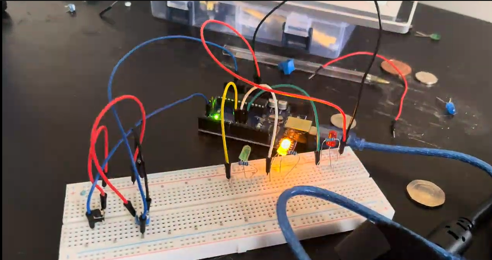

# Traffic light system that stops when a button is pressed
I connected three LEDs to the circuit. I then connected a button to A2 so that when pressed the flickering lights stop changing. I used arrays and functions to make efficient code, looping when needed.
## Video
Click Thumbnail to see the full Video demonstration

